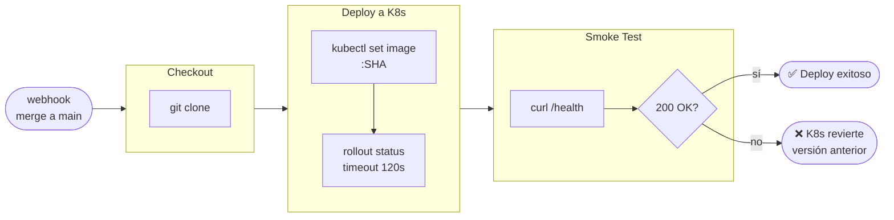

# Actividad 4 – Pipeline CI/CD con Seguridad y Monitoreo

> **Curso:** Fundamentos de DevOps – Unisabana

> **Tema:** CI/CD, seguridad (SonarQube + Snyk) y monitoreo (Prometheus + Grafana)
> **Stack:** Node.js 24 · Express · TypeScript · Docker · Kubernetes · GitHub Actions · Jenkins

**Integrantes:**
- Santiago López Amaya — santiagoloam@unisabana.edu.co
- Jeisson Alejandro Fuquene Buitrago — jeissonfubu@unisabana.edu.co

---

## Estructura del repositorio

```
04_actividad/
├── src/
│   ├── index.ts                    # Entry point — servidor Express + métricas
│   ├── metrics.ts                  # prom-client: counters, histograms, gauges
│   ├── routes/
│   │   ├── health.ts               # GET /health · GET /health/ready
│   │   └── agents.ts               # CRUD /agents
│   └── __tests__/
│       ├── health.test.ts
│       └── agents.test.ts
├── k8s/
│   ├── deployment.yaml             # Deployment + liveness/readiness probes
│   ├── service.yaml                # Service NodePort :30080
│   ├── configmap.yaml
│   └── monitoring/
│       ├── prometheus-config.yaml  # Prometheus + reglas de alerta
│       └── grafana-deployment.yaml # Grafana + dashboard auto-provisioned
├── diagrams/
│   ├── arquitectura.md             # Vista general del sistema
│   ├── cicd-flow.md                # Detalle de pipelines CI y CD
│   ├── k8s-monitoreo.md            # Stack K8s + Prometheus + Grafana
│   └── secuencia-deploy.md         # Secuencia completa de despliegue
├── docs/
│   └── informe-tecnico.md          # Documento técnico del laboratorio
├── Dockerfile                      # Multi-stage build (build → runtime mínimo)
├── Jenkinsfile                     # Pipeline CD — solo despliegue
├── sonar-project.properties        # Configuración SonarQube
└── .github/workflows/ci.yml        # Pipeline CI — calidad + seguridad + imagen
```

---

## Arquitectura general

Ver detalle en [`diagrams/arquitectura.md`](./diagrams/arquitectura.md).


---

## Pipeline CI – GitHub Actions

El workflow en `.github/workflows/ci.yml` se dispara en cada push a `feature/**` y en PRs hacia `main`. Cuatro jobs en secuencia: calidad de código → SonarQube → Snyk → Docker build & push (solo al hacer merge a `main`).


Ver detalle completo en [`diagrams/cicd-flow.md`](./diagrams/cicd-flow.md).

---

## Pipeline CD – Jenkins

El `Jenkinsfile` se dispara por webhook al detectar merge a `main`. Toma la imagen ya publicada por el CI y la despliega en el cluster K8s.



---

## Seguridad

| Herramienta | Qué analiza | Cuándo |
|-------------|-------------|--------|
| SonarQube | Código fuente: bugs, deuda técnica, cobertura | Job CI post-tests |
| Snyk | Dependencias npm: CVEs conocidos | Job CI paralelo a SonarQube |
| Docker multi-stage | Imagen mínima sin devDeps ni código fuente | Build CI |
| K8s security context | Usuario no-root, readOnlyRootFilesystem, no capabilities | Deploy CD |

---

## Monitoreo

El stack Prometheus + Grafana se despliega en el namespace `monitoring`. La app expone `/metrics` vía `prom-client` y los pods son descubiertos automáticamente por las anotaciones del Deployment.

Ver detalle en [`diagrams/k8s-monitoreo.md`](./diagrams/k8s-monitoreo.md).

```bash
# Acceder a Grafana en minikube
minikube service grafana -n monitoring --url
# Credenciales: admin / devops2024
```

---

## Inicio rápido

```bash
# Instalar y validar
npm ci
npm run typecheck && npm run lint && npm run test

# Docker local
docker build -t agents-arq:local .
docker run -p 3000:3000 agents-arq:local
curl http://localhost:3000/health
curl http://localhost:3000/metrics

# Desplegar en minikube
kubectl apply -f k8s/
kubectl apply -f k8s/monitoring/
minikube service agents-arq --url
```

---

## Secrets requeridos en GitHub

| Secret | Valor |
|--------|-------|
| `SONAR_TOKEN` | Token de autenticación SonarQube |
| `SONAR_HOST_URL` | URL del servidor SonarQube |
| `SNYK_TOKEN` | Token de Snyk |
| `DOCKERHUB_USERNAME` | Usuario de Docker Hub |
| `DOCKERHUB_TOKEN` | Token de acceso Docker Hub |
