# Actividad 4 – Pipeline CI/CD con Seguridad y Monitoreo

> **Curso:** Fundamentos de DevOps – Unisabana
> **Tema:** CI/CD, seguridad (SonarQube + Snyk) y monitoreo (Prometheus + Grafana)
> **Stack:** Node.js 24 · Express · TypeScript · Docker · Kubernetes · GitHub Actions · Jenkins

**Integrantes:**
- Santiago López Amaya — santiagoloam@unisabana.edu.co
- Jeisson Alejandro Fuquene Buitrago — jeissonfubu@unisabana.edu.co

---

## Estructura del repositorio

```
04_actividad/
├── src/
│   ├── index.ts                    # Entry point — servidor Express + métricas
│   ├── metrics.ts                  # prom-client: counters, histograms, gauges
│   ├── routes/
│   │   ├── health.ts               # GET /health · GET /health/ready
│   │   └── agents.ts               # CRUD /agents
│   └── __tests__/
│       ├── health.test.ts
│       └── agents.test.ts
├── k8s/                             # Manifiestos para Minikube (desarrollo local)
│   ├── deployment.yaml             # Deployment + liveness/readiness probes
│   ├── service.yaml                # Service NodePort :30080
│   ├── configmap.yaml
│   └── monitoring/
│       ├── prometheus-config.yaml  # Prometheus + reglas de alerta
│       └── grafana-deployment.yaml # Grafana + dashboard auto-provisioned
├── k8s/gke-autopilot/               # Manifiestos para GKE Autopilot (target real del CD)
│   ├── namespace.yaml              # Namespace monitoring
│   ├── app.yaml                    # ConfigMap + Deployment + Service ClusterIP de agents-arq
│   ├── prometheus.yaml             # RBAC + ConfigMap + Deployment + Service ClusterIP
│   ├── grafana.yaml                # ConfigMaps (datasource/dashboard) + Deployment + Service
│   └── README.md                   # Diferencias vs k8s/, costos, port-forward, verificación
├── jenkins/                         # Infra para levantar Jenkins vía docker-compose
│   ├── Dockerfile                  # Jenkins LTS + CLI docker + kubectl
│   ├── docker-compose.yml
│   └── README.md                   # Setup de plugins, credenciales y el job del Jenkinsfile
├── images/                          # Evidencia del CI (capturas embebidas en este README)
│   └── cd/                         # Evidencia del CD — despliegue real en GKE Autopilot
├── diagrams/
│   ├── arquitectura.md             # Vista general del sistema
│   ├── cicd-flow.md                # Detalle de pipelines CI y CD
│   ├── k8s-monitoreo.md            # Stack K8s + Prometheus + Grafana
│   └── secuencia-deploy.md         # Secuencia completa de despliegue
├── docs/
│   ├── informe-tecnico.md          # Documento técnico del laboratorio
│   └── comandos.md                 # Comandos usados en el despliegue real a GKE
├── Dockerfile                      # Multi-stage build (build → runtime mínimo)
├── Jenkinsfile                     # Pipeline CD — despliegue a GKE Autopilot
├── sonar-project.properties        # Configuración SonarQube
└── .github/workflows/ci.yml        # Pipeline CI — calidad + seguridad + imagen
```

---

## Arquitectura general

El sistema implementa un ciclo DevOps completo donde cada herramienta cumple un rol específico y encadenado. El developer hace push a GitHub, lo que desencadena dos flujos paralelos pero coordinados: el **CI** (GitHub Actions) que valida la calidad del código, ejecuta los análisis de seguridad y publica la imagen Docker; y el **CD** (Jenkins) que, una vez que la imagen está en el registry, la despliega en un clúster **GKE Autopilot**. El usuario final accede a la aplicación vía `kubectl port-forward` (Autopilot no expone balanceadores por defecto), mientras que el stack de monitoreo (Prometheus + Grafana) observa en tiempo real lo que ocurre dentro de los pods.

La separación entre CI y CD es intencional: GitHub Actions tiene acceso a los secretos de análisis (SonarQube, Snyk, Docker Hub) mientras que Jenkins solo necesita las credenciales de GCP (`gcp-sa-key`, `gcp-project-id`). Esto reduce la superficie de ataque y permite que cada pipeline evolucione de forma independiente. También existe una variante de manifiestos para **Minikube** ([`k8s/`](k8s/)) pensada para desarrollo/pruebas locales sin depender de GCP (ver nota en [Monitoreo](#monitoreo)).

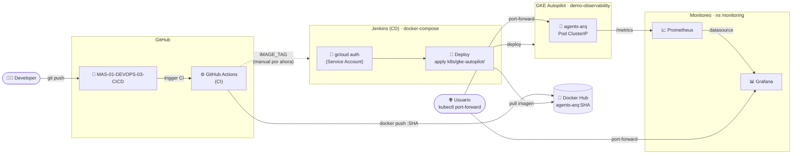

---

## Pipeline CI – GitHub Actions

El CI se activa en cada push a `feature/**` y en PRs hacia `main`, funcionando como **guardián de calidad antes del merge**. Está compuesto por cuatro jobs en secuencia estricta: si el Quality Gate falla, SonarQube y Snyk ni siquiera arrancan, evitando consumo innecesario de recursos. SonarQube y Snyk corren en paralelo entre sí, ya que son independientes. El job de Docker solo se ejecuta cuando el evento es un merge real a `main`, no en PRs, garantizando que solo el código aprobado por revisión humana y por los tres gates automáticos llega al registry.


### Evidencia de ejecución

El flujo real de trabajo es: rama `feature/*` → Pull Request hacia `main` → merge. Cada push a un PR abierto dispara el CI vía el evento `pull_request` (no `push`, para evitar runs duplicados sobre el mismo commit):

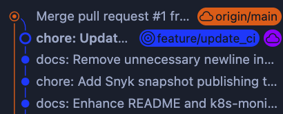

El bot **sonarqubecloud** comenta directamente en el Pull Request el resultado del Quality Gate (issues nuevos, hotspots de seguridad, cobertura y duplicación sobre el código nuevo), y GitHub bloquea el botón de merge hasta que todos los checks — incluido ese — pasan:

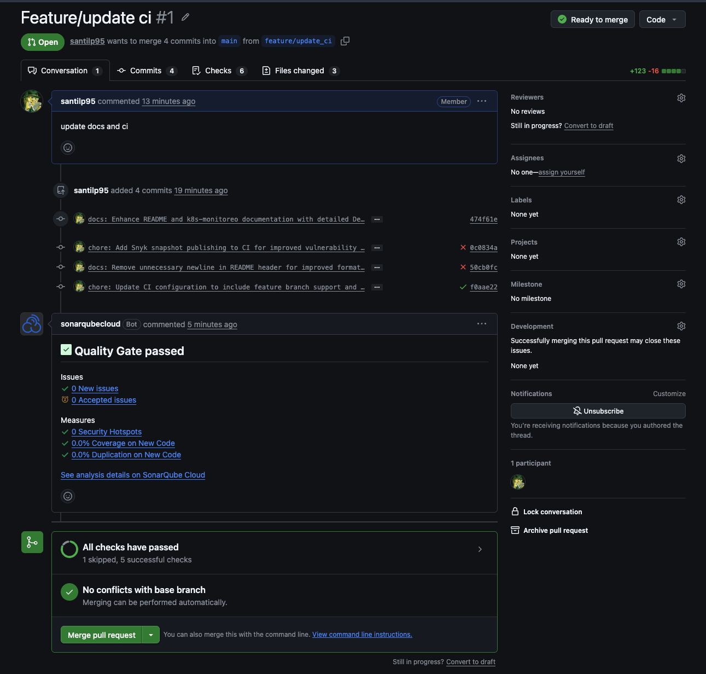

Ese run se disparó por un evento `pull_request` de tipo **`synchronize`** (un push a una rama que ya tiene PR abierto) — exactamente el escenario que causaba runs duplicados antes de quitar `feature/**` del trigger `push` en `ci.yml`. Ejecuta Quality Gate → SonarQube + Snyk en paralelo. El job `Docker Build & Push` aparece omitido (ícono de círculo cortado) porque la condición `if` del job exige que el evento sea `push` a `main` — es decir, que ya haya merge:

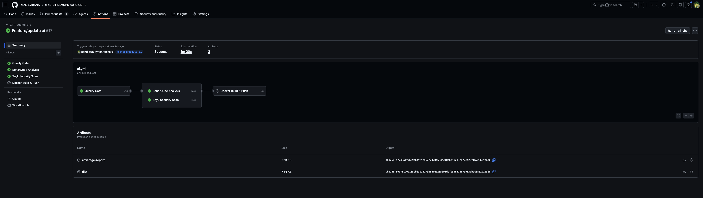

Vista de la barra lateral del mismo run, confirmando el estado de cada job (`Docker Build & Push` con el ícono de omitido):

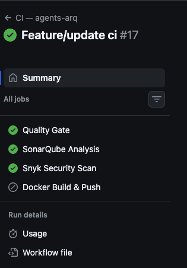

Al hacer merge del PR, el push resultante a `main` dispara una **segunda** ejecución del mismo workflow — ahora sí con el evento `push` correcto:

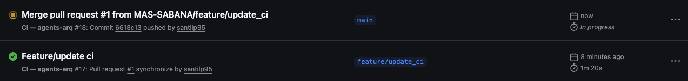

En esa segunda corrida el job `Docker Build & Push` sí se ejecuta, construye la imagen multi-stage y la publica en Docker Hub:

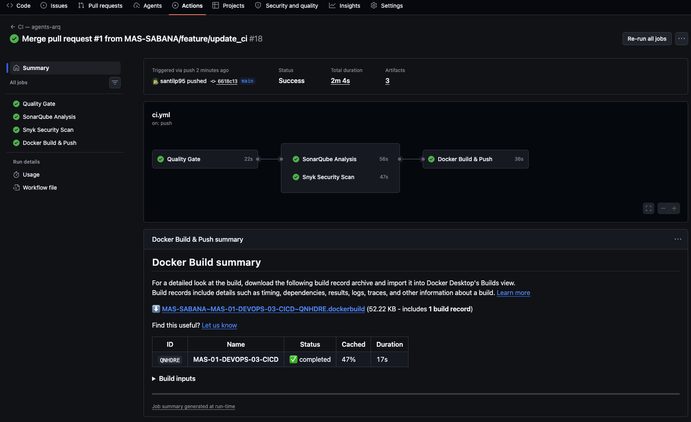

Resultado final: la imagen publicada en Docker Hub con las tags generadas automáticamente por `docker/metadata-action` (SHA del commit, `main`, `latest`):

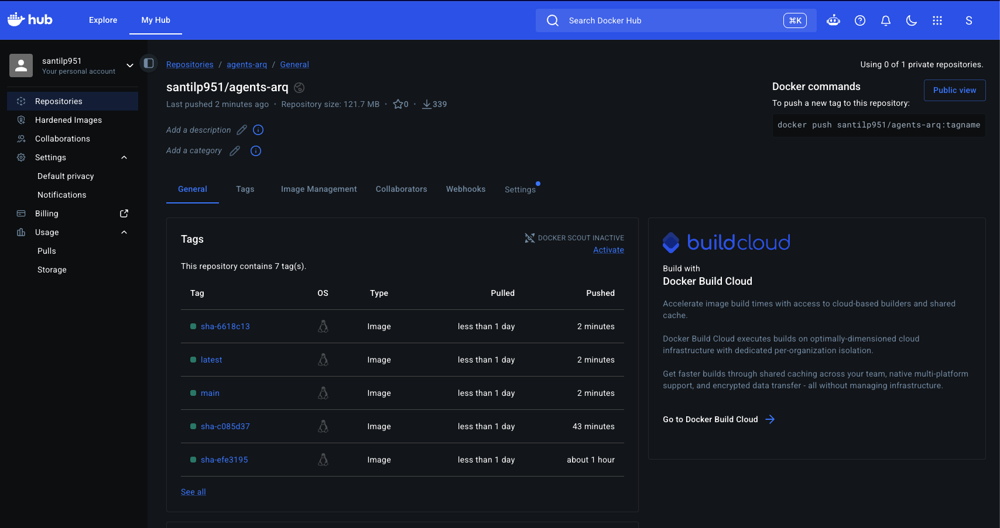

---

## Pipeline CD – Jenkins

El CD despliega a un clúster **GKE Autopilot** real (no Minikube): Jenkins corre en `docker-compose` ([`jenkins/`](jenkins/)) con un agente `google/cloud-sdk` que trae `gcloud` + `kubectl`. El job recibe como parámetro `IMAGE_TAG` — el tag ya publicado por el CI en Docker Hub —, se autentica en GCP con una Service Account, sustituye el placeholder `__IMAGE__` en `k8s/gke-autopilot/app.yaml` por esa imagen y aplica los cuatro manifiestos (`namespace`, `prometheus`, `grafana`, `app`) contra el clúster. Igual que antes, no repite pasos de calidad ni seguridad: confía en que el CI ya los hizo. Cierra con un smoke test contra `/health` dentro del propio pod.

> **Nota:** el disparo automático GitHub Actions → Jenkins (pasando `IMAGE_TAG`) está documentado en [`k8s/gke-autopilot/README.md`](k8s/gke-autopilot/README.md) pero **aún no está implementado** en `ci.yml` — por ahora el job de Jenkins se lanza manualmente con ese parámetro.

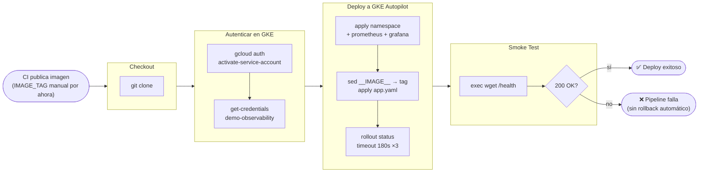

**Infraestructura de Jenkins** ([`jenkins/`](jenkins/)): Jenkins LTS corriendo en `docker-compose`, con una imagen custom que solo agrega lo que la UI no puede instalar sola — el CLI de `docker` (para el agente `docker { image ... }`) y `kubectl`. Plugins, credenciales y el job en sí se configuran a mano desde la UI del asistente de setup.

**Por qué los manifiestos de GKE Autopilot son distintos a los de Minikube** (`k8s/gke-autopilot/` vs `k8s/`):

- `Service` en `ClusterIP` en vez de `NodePort` — los nodos de Autopilot no tienen IP externa, por eso todo el acceso es vía `kubectl port-forward`.
- Prometheus lleva **RBAC propio** (ServiceAccount + ClusterRole): sin esto el service discovery de pods falla por permiso denegado.
- `resources.requests == resources.limits` en los 3 pods, con CPU en múltiplos de 250m — requisito de Autopilot; si no se cumple, Autopilot redondea hacia arriba y se paga de más.
- Grafana sin credenciales hardcodeadas: usa `admin`/`admin` y pide cambiarla en el primer login.
- Costo aproximado: ~USD 30–35/mes por los 3 pods (750m vCPU + 2 GiB RAM) + gestión del clúster ~USD 0.10/h (~USD 74/mes, con 1 clúster gratis por cuenta de facturación de GCP).

### Evidencia de despliegue en GKE

Corrida real del job `agent-app` #6 en Jenkins: las 6 etapas del `Jenkinsfile` (Checkout, Autenticar en GKE, Deploy a GKE Autopilot, Smoke Test, Post Actions) en verde, 49s de duración:

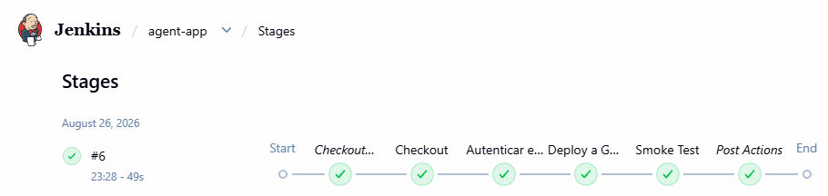

El log de consola confirma el smoke test (`/health` responde `"status":"ok"`) y el cierre exitoso del pipeline:

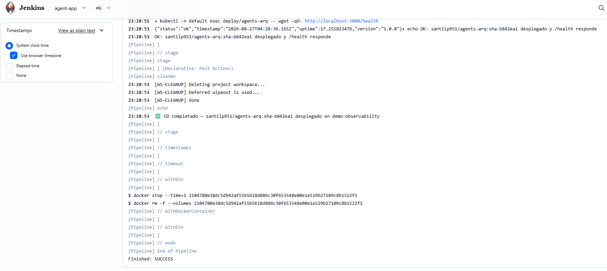

Trazabilidad CI → CD: el pod corriendo en el clúster usa exactamente la imagen `sha-b842ea1` — la misma que publicó el job Docker del CI, no una copia distinta:

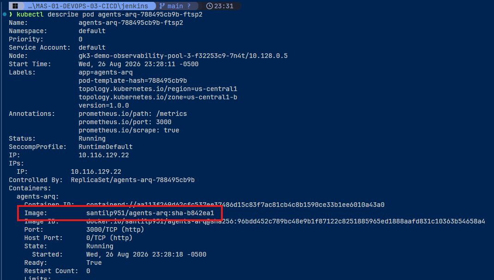

Los 3 workloads (`agents-arq`, `prometheus`, `grafana`) corriendo en el clúster Autopilot `demo-observability`, gestionados como pods normales sobre nodos que Autopilot aprovisiona automáticamente:

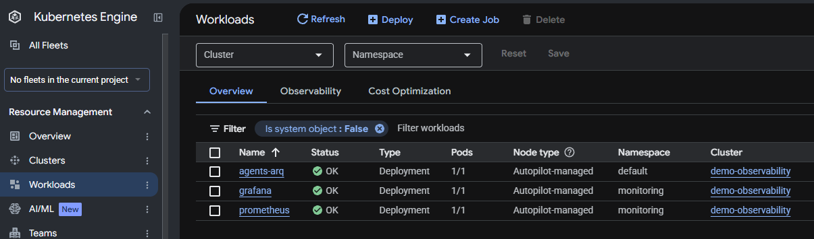

La app respondiendo en vivo a través de `kubectl port-forward`:

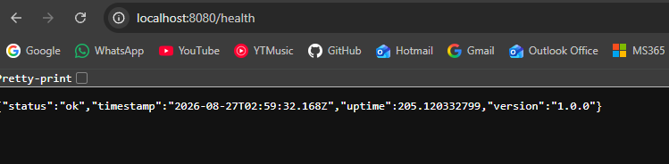

El dashboard `agents-arq — DevOps Dashboard` en Grafana, con datos reales scrapeados del pod (requests/seg, latencia P95, tasa de errores 5xx, agentes activos, CPU y memoria RSS):

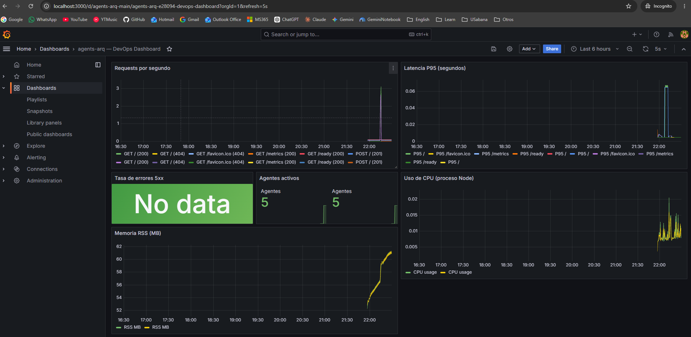

Los dos targets de Prometheus (`agents-arq` y `kubernetes-pods`) en estado `UP`, confirmando que el service discovery vía RBAC funciona en Autopilot:

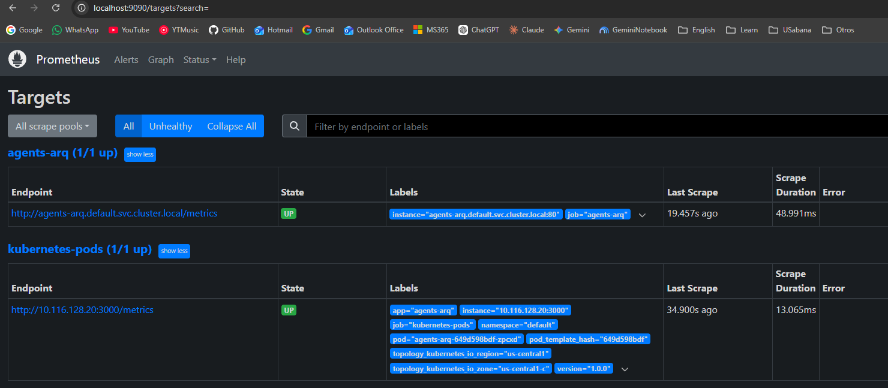

Los tres servicios se acceden vía `kubectl port-forward` (nada queda expuesto públicamente en Autopilot):

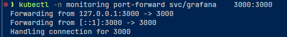

Extracto real de la terminal de este despliegue (creación del clúster y aplicación de manifiestos):

```bash
❯ gcloud container clusters create-auto demo-observability --location=us-central1 --release-channel=regular
API [container.googleapis.com] not enabled on project [devop-505501]. Would you like to enable and retry? (y/N)?  y
Creating cluster demo-observability in us-central1... Cluster is being health-checked...done.
Created [https://container.googleapis.com/v1/projects/devop-505501/zones/us-central1/clusters/demo-observability].

kubectl apply -f k8s/gke-autopilot/namespace.yaml
kubectl apply -f k8s/gke-autopilot/app.yaml
kubectl apply -f k8s/gke-autopilot/prometheus.yaml
kubectl apply -f k8s/gke-autopilot/grafana.yaml
```

---

## Seguridad

| Herramienta | Qué analiza | Cuándo |
|-------------|-------------|--------|
| SonarQube | Código fuente: bugs, deuda técnica, cobertura | Job CI post-tests |
| Snyk | Dependencias npm: CVEs conocidos | Job CI paralelo a SonarQube |
| Docker multi-stage | Imagen mínima sin devDeps ni código fuente | Build CI |
| K8s security context | Usuario no-root, readOnlyRootFilesystem, no capabilities | Deploy CD |

**SonarQube Cloud** — proyecto `MAS-SABANA_MAS-01-DEVOPS-03-CICD`, Quality Gate en verde, sin issues de seguridad ni bugs, 91% de cobertura y 0% de duplicación:

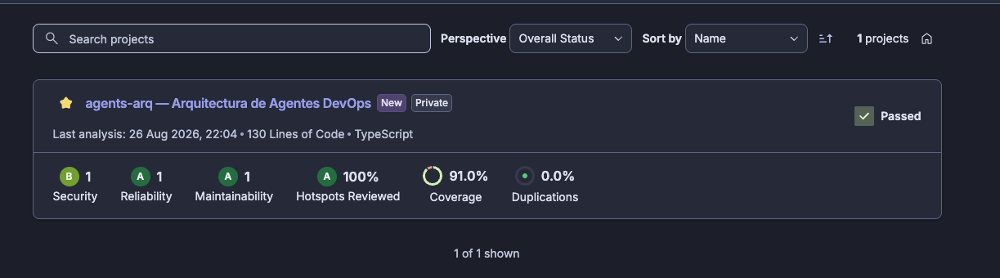

**Snyk** — el job de CI corre `snyk test` (gate que falla el build ante vulnerabilidades `high`/`critical`) y, solo en push a `main`, `snyk monitor`, que publica este snapshot en el dashboard: 97 dependencias analizadas, 0 issues encontrados:

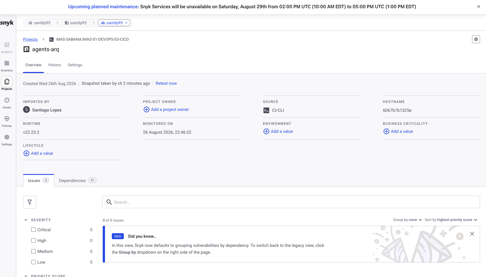

---

## Monitoreo

> Esta sección describe la variante **Minikube** (`k8s/monitoring/`). La variante que corre de verdad en producción es **GKE Autopilot** (`k8s/gke-autopilot/`): mismo par Prometheus + Grafana, pero con `Service` en `ClusterIP` + `kubectl port-forward` (Autopilot no expone NodePort) y RBAC propio para el service discovery — ver la evidencia real en [Pipeline CD – Jenkins](#pipeline-cd--jenkins) y el detalle en [`k8s/gke-autopilot/README.md`](k8s/gke-autopilot/README.md).

El stack Prometheus + Grafana se despliega en el namespace `monitoring`. La app expone `/metrics` vía `prom-client` y los pods son descubiertos automáticamente por las anotaciones del Deployment. Prometheus evalúa reglas de alerta (`HighErrorRate`, `HighLatency`, `PodDown`) y alimenta como datasource a Grafana, que carga el dashboard `agents-arq-main` de forma automática desde un ConfigMap — sin configuración manual al arrancar.


---

## Secrets y credenciales

**GitHub Actions (CI)** — conectan el pipeline de CI con SonarQube Cloud, Snyk y Docker Hub:

| Secret | Valor |
|--------|-------|
| `SONAR_TOKEN` | Token de autenticación SonarQube |
| `SONAR_HOST_URL` | URL del servidor SonarQube (`https://sonarcloud.io`) |
| `SNYK_TOKEN` | Token de Snyk |
| `DOCKERHUB_USERNAME` | Usuario de Docker Hub |
| `DOCKERHUB_TOKEN` | Token de acceso Docker Hub |

**Jenkins (CD)** — configuradas directamente en el controller (no son secrets de GitHub), usadas por el `Jenkinsfile` para autenticar contra GCP y desplegar en GKE Autopilot:

| Credencial | Tipo | Uso |
|------------|------|-----|
| `gcp-sa-key` | Secret file | JSON de una Service Account de GCP con `roles/container.developer` |
| `gcp-project-id` | Secret text | ID del proyecto GCP |
