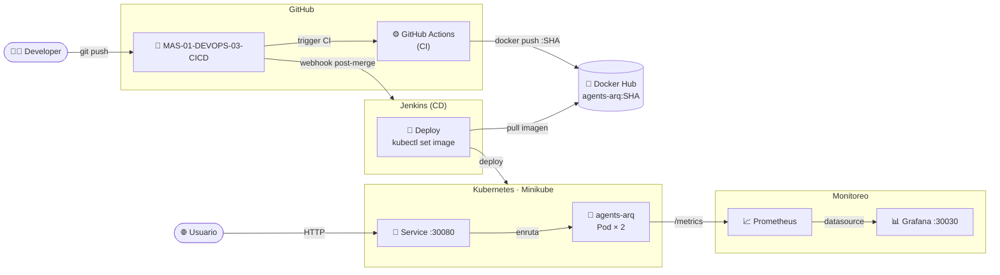
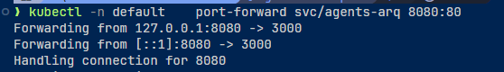
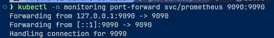

# Actividad 4 – Pipeline CI/CD con Seguridad y Monitoreo

> **Curso:** Fundamentos de DevOps – Unisabana
> **Tema:** CI/CD, seguridad (SonarQube + Snyk) y monitoreo (Prometheus + Grafana)
> **Stack:** Node.js 24 · Express · TypeScript · Docker · Kubernetes · GitHub Actions · Jenkins

**Integrantes:**
- Santiago López Amaya — santiagoloam@unisabana.edu.co
- Jeisson Alejandro Fuquene Buitrago — jeissonfubu@unisabana.edu.co

---

## Estructura del repositorio

```
04_actividad/
├── src/
│   ├── index.ts                    # Entry point — servidor Express + métricas
│   ├── metrics.ts                  # prom-client: counters, histograms, gauges
│   ├── routes/
│   │   ├── health.ts               # GET /health · GET /health/ready
│   │   └── agents.ts               # CRUD /agents
│   └── __tests__/
│       ├── health.test.ts
│       └── agents.test.ts
├── k8s/
│   ├── deployment.yaml             # Deployment + liveness/readiness probes
│   ├── service.yaml                # Service NodePort :30080
│   ├── configmap.yaml
│   └── monitoring/
│       ├── prometheus-config.yaml  # Prometheus + reglas de alerta
│       └── grafana-deployment.yaml # Grafana + dashboard auto-provisioned
├── diagrams/
│   ├── arquitectura.md             # Vista general del sistema
│   ├── cicd-flow.md                # Detalle de pipelines CI y CD
│   ├── k8s-monitoreo.md            # Stack K8s + Prometheus + Grafana
│   └── secuencia-deploy.md         # Secuencia completa de despliegue
├── images/                         # Evidencia del laboratorio
│   ├── cd/                         # Capturas del pipeline CD y monitoreo
│   └── *.png                       # Capturas del pipeline CI y seguridad
├── actividad-2/
│   └── postmortem-devops-mlops.md  # Post-mortem + DevOps vs MLOps
├── Dockerfile                      # Multi-stage build (build → runtime mínimo)
├── Jenkinsfile                     # Pipeline CD — solo despliegue
├── sonar-project.properties        # Configuración SonarQube
└── .github/workflows/ci.yml        # Pipeline CI — calidad + seguridad + imagen
```

---

## Arquitectura general

El sistema implementa un ciclo DevOps completo donde cada herramienta cumple un rol específico y encadenado. El developer hace push a GitHub, lo que desencadena dos flujos paralelos pero coordinados: el **CI** (GitHub Actions) que valida la calidad del código, ejecuta los análisis de seguridad y publica la imagen Docker; y el **CD** (Jenkins) que, una vez que la imagen está en el registry, la despliega en el cluster de Kubernetes. El usuario final accede a la aplicación a través del Service de K8s, mientras que el stack de monitoreo (Prometheus + Grafana) observa en tiempo real lo que ocurre dentro de los pods.

La separación entre CI y CD es intencional: GitHub Actions tiene acceso a los secretos de análisis (SonarQube, Snyk, Docker Hub) mientras que Jenkins solo necesita el kubeconfig del cluster. Esto reduce la superficie de ataque y permite que cada pipeline evolucione de forma independiente.



El modelo de branching usa una rama larga `main` y ramas de corta duración `feature/*`. Cada `feature` abre un PR hacia `main`; el CI lo valida automáticamente; tras el merge, el CD lo despliega.


Ver detalle en [`diagrams/arquitectura.md`](./diagrams/arquitectura.md).

---

## Pipeline CI – GitHub Actions

El CI se activa en cada push a `feature/**` y en PRs hacia `main`, funcionando como **guardián de calidad antes del merge**. Está compuesto por cuatro jobs en secuencia estricta: si el Quality Gate falla, SonarQube y Snyk ni siquiera arrancan, evitando consumo innecesario de recursos. SonarQube y Snyk corren en paralelo entre sí, ya que son independientes. El job de Docker solo se ejecuta cuando el evento es un merge real a `main`, no en PRs, garantizando que solo el código aprobado por revisión humana y por los tres gates automáticos llega al registry.


### Evidencia del pipeline CI

El CI ejecutándose en un PR: todos los jobs pasan antes de permitir el merge.


El Quality Gate del PR bloquea el merge hasta que typecheck, lint, tests y build sean exitosos.


Tras el merge a `main`, el CI ejecuta el job de Docker adicional y publica la imagen.


### Análisis de seguridad — SonarCloud

SonarQube centraliza el análisis de calidad del código y la deuda técnica. Su Quality Gate actúa como guardián automático: si la cobertura de tests cae por debajo del umbral o aparecen bugs bloqueantes, el pipeline se detiene, haciendo explícito un estándar de calidad que de otro modo quedaría implícito o ignorado.


### Análisis de dependencias — Snyk

Snyk se especializa en vulnerabilidades de la cadena de suministro (dependencias de npm). A diferencia de SonarQube que analiza el código propio, Snyk monitorea si una librería de tercero tiene un CVE conocido. La integración con el panel de seguridad de GitHub via SARIF permite ver y remediar vulnerabilidades sin salir de la plataforma.


### Imagen publicada en Docker Hub

El job de Docker construye la imagen multi-stage, la etiqueta con el SHA del commit y la etiqueta `latest`, y la publica en Docker Hub. Solo se ejecuta en merges a `main`, garantizando que solo el código revisado llega al registry.


Ver detalle completo en [`diagrams/cicd-flow.md`](./diagrams/cicd-flow.md).

---

## Pipeline CD – Jenkins

El CD se dispara por webhook al detectar un merge a `main`. Su única responsabilidad es tomar la imagen ya validada y publicada por el CI y llevarla al cluster. **No repite ningún paso de calidad ni seguridad**: confía en que el CI ya hizo ese trabajo. El `kubectl rollout status` actúa como verificación de disponibilidad real — si los pods no pasan las readiness probes en 120 segundos, Kubernetes mantiene automáticamente la versión anterior activa.


### Evidencia del pipeline CD

Vista de stages en Jenkins: los tres stages (Checkout → Deploy → Smoke Test) en verde.


Logs de Jenkins mostrando el `kubectl set image` y el `rollout status` exitoso.


Los pods corriendo en Kubernetes con la imagen actualizada al SHA del último commit.


La aplicación respondiendo a través del Service de Kubernetes.




---

## Seguridad

La seguridad se implementa en cuatro capas a lo largo del pipeline, siguiendo el principio de _shift-left_: los problemas se detectan cuanto antes, cuando el costo de corregirlos es mínimo.

| Herramienta | Qué analiza | Cuándo |
|-------------|-------------|--------|
| SonarQube | Código fuente: bugs, deuda técnica, cobertura | Job CI post-tests |
| Snyk | Dependencias npm: CVEs conocidos | Job CI paralelo a SonarQube |
| Docker multi-stage | Imagen mínima sin devDeps ni código fuente | Build CI |
| K8s security context | Usuario no-root, readOnlyRootFilesystem, no capabilities | Deploy CD |

El Deployment de Kubernetes refuerza el aislamiento en tiempo de ejecución: los pods corren con un usuario no-root (UID 1000), el filesystem es de solo lectura y no tienen ninguna Linux capability adicional.

---

## Monitoreo

El stack Prometheus + Grafana se despliega en el namespace `monitoring`. La app expone `/metrics` vía `prom-client` y los pods son descubiertos automáticamente por las anotaciones del Deployment. Prometheus evalúa reglas de alerta (`HighErrorRate`, `HighLatency`, `PodDown`) y alimenta como datasource a Grafana, que carga el dashboard `agents-arq-main` de forma automática desde un ConfigMap — sin configuración manual al arrancar.

La aplicación instrumenta tres métricas propias: `http_requests_total` (Counter por método/ruta/status), `http_request_duration_seconds` (Histogram para P50/P95/P99) y `active_agents_total` (Gauge). Estas, combinadas con las métricas de runtime de Node.js (CPU, memoria RSS), alimentan los 6 paneles del dashboard.


### Evidencia del monitoreo

Prometheus activo, scrapeando los pods de la aplicación.




Dashboard de Grafana con los paneles de requests/s, latencia P95, tasa de errores y agentes activos.


Ver detalle completo en [`diagrams/k8s-monitoreo.md`](./diagrams/k8s-monitoreo.md).

```bash
# Acceder a Grafana en minikube
minikube service grafana -n monitoring --url
# Credenciales: admin / devops2024
```

---

## Herramientas utilizadas y justificación

**GitHub Actions** fue elegido como motor de CI por su integración nativa con GitHub, su ecosistema de acciones reutilizables y la facilidad para configurar workflows en YAML. Su capacidad de ejecutar jobs en paralelo reduce significativamente el tiempo de feedback al desarrollador.

**Jenkins** complementa el stack como motor de CD porque permite un control más granular del proceso de despliegue, integración con Kubernetes vía credenciales seguras y una UI rica para revisar el historial de pipelines. En entornos empresariales es común esta combinación: GitHub Actions para CI rápida y Jenkins para CD orquestado.

**SonarQube** centraliza el análisis de calidad del código y la deuda técnica. Su Quality Gate actúa como guardián automático: si la cobertura de tests cae por debajo del umbral o aparecen bugs bloqueantes, el pipeline se detiene.

**Snyk** se especializa en vulnerabilidades de la cadena de suministro (dependencias de npm). El flag `--severity-threshold=high` permite que vulnerabilidades de severidad media no bloqueen el pipeline mientras se trabaja en actualizarlas, pero las altas y críticas sí lo hacen.

**Prometheus** recolecta métricas en formato text-exposition desde el endpoint `/metrics` de la aplicación cada 10 segundos. Las alertas definidas en `alerts.yml` cubren los tres escenarios críticos: alta tasa de errores (> 10% por 2 min), latencia elevada (P95 > 1s por 5 min) y pod caído (`up == 0` por 1 min).

**Grafana** consume las métricas de Prometheus y las visualiza en un dashboard pre-configurado que se provisiona automáticamente desde ConfigMaps, eliminando la configuración manual post-despliegue.

---

## Reflexión sobre eficiencia operativa

La implementación de este pipeline CI/CD representa un salto cualitativo en la eficiencia operativa. Antes de esta automatización, la validación de calidad dependía de la disciplina individual de cada desarrollador; ahora, el pipeline actúa como árbitro imparcial que aplica los mismos estándares en cada commit.

El tiempo de feedback se reduce drásticamente: un desarrollador recibe en menos de 5 minutos la confirmación de que su código pasa typecheck, lint y tests, lo que permite correcciones tempranas cuando el contexto del cambio aún está fresco. La integración de seguridad desplaza las vulnerabilidades hacia la izquierda del ciclo (_shift-left security_): en lugar de descubrirlas en producción, se detectan en el Pull Request.

El monitoreo continuo cierra el ciclo DevOps: el mismo equipo que desarrolla y despliega tiene visibilidad inmediata del comportamiento de la aplicación en producción. Las alertas configuradas convierten el monitoreo reactivo en proactivo, notificando problemas antes de que el usuario final los reporte.

Una área de mejora identificada es la ausencia de tests de carga automatizados en el pipeline. Incorporar herramientas como k6 o Artillery en una etapa de performance testing post-deploy completaría el ciclo de calidad.

---

## Secrets requeridos en GitHub

| Secret | Valor |
|--------|-------|
| `SONAR_TOKEN` | Token de autenticación SonarQube |
| `SONAR_HOST_URL` | URL del servidor SonarQube |
| `SNYK_TOKEN` | Token de Snyk |
| `DOCKERHUB_USERNAME` | Usuario de Docker Hub |
| `DOCKERHUB_TOKEN` | Token de acceso Docker Hub |
