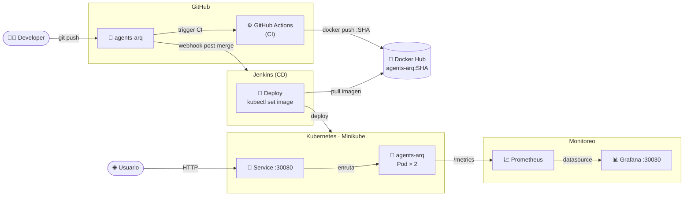
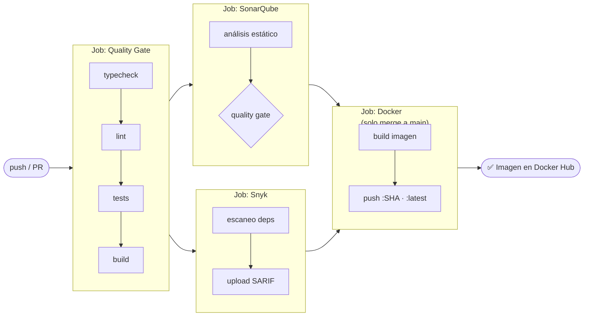
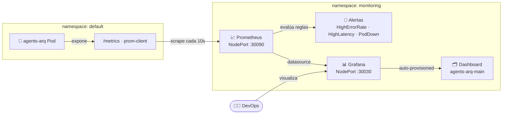

# Actividad 4 – Pipeline CI/CD con Seguridad y Monitoreo

> **Curso:** Fundamentos de DevOps – Unisabana
> **Tema:** CI/CD, seguridad (SonarQube + Snyk) y monitoreo (Prometheus + Grafana)
> **Stack:** Node.js 24 · Express · TypeScript · Docker · Kubernetes · GitHub Actions · Jenkins

**Integrantes:**
- Santiago López Amaya — santiagoloam@unisabana.edu.co
- Jeisson Alejandro Fuquene Buitrago — jeissonfubu@unisabana.edu.co

---

## Estructura del repositorio

```
04_actividad/
├── src/
│   ├── index.ts                    # Entry point — servidor Express + métricas
│   ├── metrics.ts                  # prom-client: counters, histograms, gauges
│   ├── routes/
│   │   ├── health.ts               # GET /health · GET /health/ready
│   │   └── agents.ts               # CRUD /agents
│   └── __tests__/
│       ├── health.test.ts
│       └── agents.test.ts
├── k8s/
│   ├── deployment.yaml             # Deployment + liveness/readiness probes
│   ├── service.yaml                # Service NodePort :30080
│   ├── configmap.yaml
│   └── monitoring/
│       ├── prometheus-config.yaml  # Prometheus + reglas de alerta
│       └── grafana-deployment.yaml # Grafana + dashboard auto-provisioned
├── diagrams/
│   ├── arquitectura.md             # Vista general del sistema
│   ├── cicd-flow.md                # Detalle de pipelines CI y CD
│   ├── k8s-monitoreo.md            # Stack K8s + Prometheus + Grafana
│   └── secuencia-deploy.md         # Secuencia completa de despliegue
├── docs/
│   └── informe-tecnico.md          # Documento técnico del laboratorio
├── Dockerfile                      # Multi-stage build (build → runtime mínimo)
├── Jenkinsfile                     # Pipeline CD — solo despliegue
├── sonar-project.properties        # Configuración SonarQube
└── .github/workflows/ci.yml        # Pipeline CI — calidad + seguridad + imagen
```

---

## Arquitectura general

El sistema implementa un ciclo DevOps completo donde cada herramienta cumple un rol específico y encadenado. El developer hace push a GitHub, lo que desencadena dos flujos paralelos pero coordinados: el **CI** (GitHub Actions) que valida la calidad del código, ejecuta los análisis de seguridad y publica la imagen Docker; y el **CD** (Jenkins) que, una vez que la imagen está en el registry, la despliega en el cluster de Kubernetes. El usuario final accede a la aplicación a través del Service de K8s, mientras que el stack de monitoreo (Prometheus + Grafana) observa en tiempo real lo que ocurre dentro de los pods.

La separación entre CI y CD es intencional: GitHub Actions tiene acceso a los secretos de análisis (SonarQube, Snyk, Docker Hub) mientras que Jenkins solo necesita el kubeconfig del cluster. Esto reduce la superficie de ataque y permite que cada pipeline evolucione de forma independiente.



Ver detalle en [`diagrams/arquitectura.md`](./diagrams/arquitectura.md).

---

## Pipeline CI – GitHub Actions

El CI se activa en cada push a `feature/**` y en PRs hacia `main`, funcionando como **guardián de calidad antes del merge**. Está compuesto por cuatro jobs en secuencia estricta: si el Quality Gate falla, SonarQube y Snyk ni siquiera arrancan, evitando consumo innecesario de recursos. SonarQube y Snyk corren en paralelo entre sí, ya que son independientes. El job de Docker solo se ejecuta cuando el evento es un merge real a `main`, no en PRs, garantizando que solo el código aprobado por revisión humana y por los tres gates automáticos llega al registry.



Ver detalle completo en [`diagrams/cicd-flow.md`](./diagrams/cicd-flow.md).

---

## Pipeline CD – Jenkins

El CD se dispara por webhook al detectar un merge a `main`. Su única responsabilidad es tomar la imagen ya validada y publicada por el CI y llevarla al cluster. No repite ningún paso de calidad ni seguridad: confía en que el CI ya hizo ese trabajo. El `kubectl rollout status` actúa como verificación de disponibilidad real — si los pods no pasan las readiness probes en 120 segundos, Kubernetes mantiene automáticamente la versión anterior activa.


---

## Seguridad

| Herramienta | Qué analiza | Cuándo |
|-------------|-------------|--------|
| SonarQube | Código fuente: bugs, deuda técnica, cobertura | Job CI post-tests |
| Snyk | Dependencias npm: CVEs conocidos | Job CI paralelo a SonarQube |
| Docker multi-stage | Imagen mínima sin devDeps ni código fuente | Build CI |
| K8s security context | Usuario no-root, readOnlyRootFilesystem, no capabilities | Deploy CD |

---

## Monitoreo

El stack Prometheus + Grafana se despliega en el namespace `monitoring`. La app expone `/metrics` vía `prom-client` y los pods son descubiertos automáticamente por las anotaciones del Deployment. Prometheus evalúa reglas de alerta (`HighErrorRate`, `HighLatency`, `PodDown`) y alimenta como datasource a Grafana, que carga el dashboard `agents-arq-main` de forma automática desde un ConfigMap — sin configuración manual al arrancar.



Ver detalle completo en [`diagrams/k8s-monitoreo.md`](./diagrams/k8s-monitoreo.md).

```bash
# Acceder a Grafana en minikube
minikube service grafana -n monitoring --url
# Credenciales: admin / devops2024
```

---

## Desarrollo local

Para correr el proyecto en local sin necesidad de un cluster ni de las herramientas de CI/CD:

**Requisitos previos**

| Herramienta | Versión mínima |
|-------------|----------------|
| Node.js | 24+ |
| Docker | 24+ |
| kubectl | 1.28+ |
| Minikube | cualquiera |

**Levantar la app en modo desarrollo**

```bash
# Clonar e instalar dependencias
git clone https://github.com/templatesSLA/agents-arq
cd agents-arq
npm ci

# Validar el código antes de tocar nada
npm run typecheck
npm run lint
npm run test        # incluye cobertura

# Levantar con hot-reload (ts-node)
npm run dev
# → http://localhost:3000/health
# → http://localhost:3000/metrics
# → http://localhost:3000/agents
```

**Levantar con Docker (simula producción)**

```bash
docker build -t agents-arq:local .
docker run --rm -p 3000:3000 agents-arq:local

# Verificar que el health check del contenedor responde
curl http://localhost:3000/health
```

**Desplegar en Minikube con monitoreo**

```bash
minikube start

# Crear namespace de monitoreo y aplicar manifiestos
kubectl create namespace monitoring
kubectl apply -f k8s/
kubectl apply -f k8s/monitoring/

# Verificar que los pods están corriendo
kubectl get pods
kubectl get pods -n monitoring

# Acceder a la app
minikube service agents-arq --url

# Acceder a Grafana (admin / devops2024)
minikube service grafana -n monitoring --url
```

---

## Secrets requeridos en GitHub

| Secret | Valor |
|--------|-------|
| `SONAR_TOKEN` | Token de autenticación SonarQube |
| `SONAR_HOST_URL` | URL del servidor SonarQube |
| `SNYK_TOKEN` | Token de Snyk |
| `DOCKERHUB_USERNAME` | Usuario de Docker Hub |
| `DOCKERHUB_TOKEN` | Token de acceso Docker Hub |
