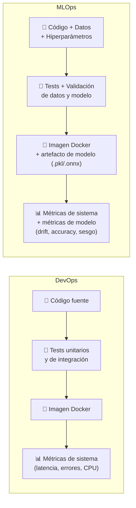

# Actividad 2 – Post-mortem y comparación DevOps vs MLOps

> **Curso:** Fundamentos de DevOps – Unisabana
> **Tipo:** Grupal · Entrega escrita

**Integrantes:**
- Santiago López Amaya — santiagoloam@unisabana.edu.co
- Jeisson Alejandro Fuquene Buitrago — jeissonfubu@unisabana.edu.co

---

## 1. Post-mortem del laboratorio

### ¿Qué salió bien?

La separación entre CI y CD fue una de las decisiones más acertadas del laboratorio. Definir que GitHub Actions es el responsable de la calidad —typecheck, lint, tests, SonarQube, Snyk— y que Jenkins es el responsable exclusivo del despliegue, simplificó radicalmente el Jenkinsfile: pasó de ser un pipeline que intentaba hacer todo a ser tres stages concretos (Checkout → Deploy → Smoke Test). Esta claridad redujo los errores de configuración y hace que cualquier persona del equipo pueda entender el pipeline de un vistazo.

El uso de Docker multi-stage build resultó muy efectivo para reducir el tamaño de la imagen final. Al separar el stage de compilación TypeScript del stage de runtime, la imagen de producción no contiene ni el código fuente TypeScript, ni las dependencias de desarrollo, ni el compilador. Esto reduce la superficie de ataque y el tiempo de descarga de la imagen en cada despliegue.

La instrumentación con `prom-client` desde el inicio del proyecto —en lugar de agregarla como una capa posterior— permitió que el stack de monitoreo estuviera listo en paralelo con la app. El dashboard de Grafana se provisionó automáticamente desde ConfigMaps, eliminando la configuración manual que suele ser fuente de inconsistencias entre entornos.

### ¿Qué salió mal o fue más difícil de lo esperado?

La configuración del Quality Gate de SonarQube requirió más iteraciones de las esperadas. El token de autenticación, la URL del servidor y la acción `waitForQualityGate` tienen dependencias de timing que no son evidentes en la documentación oficial: el análisis puede terminar sin que el Quality Gate haya sido evaluado, lo que genera falsos positivos en el pipeline. La solución fue agregar un polling explícito y ajustar el timeout del workflow.

Los probes de Kubernetes (liveness y readiness) en el Deployment inicial apuntaban al mismo endpoint `/health`, lo que genera un problema de diseño: si la app está viva pero cargada, el liveness probe la reinicia innecesariamente. Fue necesario separar los endpoints (`/health` para liveness, `/health/ready` para readiness) y ajustar los parámetros de `initialDelaySeconds` y `failureThreshold` para evitar reinicios prematuros durante el arranque del pod.

La gestión del `kubeconfig` en Jenkins requirió un cuidado especial. Almacenarlo como credencial de tipo "Secret File" en Jenkins y referenciarlo con `withCredentials` fue la solución correcta, pero la documentación de Jenkins no lo hace evidente para quien viene de GitHub Actions, donde los secretos se inyectan como variables de entorno de forma más directa.

### ¿Qué aprendimos?

El laboratorio hizo evidente que DevOps no es una herramienta sino una cadena de decisiones de diseño. Cada herramienta cumple un rol específico en el pipeline, y la efectividad del sistema depende de que esos roles estén bien definidos y no se solapen. Cuando Jenkins intentaba hacer lo mismo que GitHub Actions (ejecutar tests, SonarQube, Snyk), el resultado era un pipeline lento, frágil y difícil de depurar. Cuando cada herramienta hizo solo lo que le corresponde, el sistema se volvió coherente.

También aprendimos que el monitoreo es parte del contrato de la aplicación, no un complemento opcional. Instrumentar la app desde el código (métricas propias + métricas de runtime de Node.js) y conectarlas a alertas con umbrales concretos transforma el monitoreo de una actividad reactiva a una proactiva: el equipo no espera a que un usuario reporte un problema, sino que recibe una alerta cuando la tasa de errores supera el 10% o la latencia P95 supera 1 segundo.

### ¿Qué podemos mejorar?

El pipeline actual no incluye tests de carga ni tests de integración contra dependencias reales (bases de datos, servicios externos). Incorporar una herramienta como **k6** o **Artillery** en una etapa post-deploy permitiría detectar regresiones de rendimiento antes de que los usuarios las experimenten. Esto completaría el ciclo de calidad que actualmente solo cubre la corrección funcional (tests unitarios) y la seguridad estática (SonarQube, Snyk).

La estrategia de despliegue actual es RollingUpdate con dos réplicas, lo que puede causar downtime breve si ambos pods coinciden en un reinicio. Una estrategia Blue/Green o Canary, soportada por un Ingress Controller, ofrecería despliegues sin downtime y la posibilidad de validar la nueva versión con un subconjunto del tráfico antes de migrar el 100%.

---

## 2. DevOps vs MLOps — diferencias, similitudes y por qué importa la distinción

### Qué comparten

DevOps y MLOps parten del mismo principio fundacional: acortar el ciclo entre el desarrollo de un artefacto y su operación en producción, mediante automatización, observabilidad y ciclos de retroalimentación rápidos (Kreuzberger et al., 2023). Ambas disciplinas aplican pipelines de CI/CD, control de versiones, contenedores, monitoreo continuo y colaboración entre equipos de desarrollo y operaciones.

El stack construido en este laboratorio —GitHub Actions, Jenkins, Docker, Kubernetes, Prometheus y Grafana— es perfectamente válido como base de un sistema MLOps. Las diferencias no están en las herramientas sino en **qué se versiona, qué se valida y qué se monitorea**.

### Qué los diferencia

La diferencia estructural más profunda es que en MLOps **los datos son un artefacto de primera clase** junto al código (Sculley et al., 2015). Un modelo de machine learning puede degradarse en producción sin que una sola línea de código cambie: basta con que la distribución de los datos de entrada se aleje de la distribución con la que fue entrenado, fenómeno conocido como **data drift** o **concept drift**.

Esto introduce una capa de complejidad que DevOps no tiene:

| Dimensión | DevOps | MLOps |
|-----------|--------|-------|
| Artefacto principal | Código compilado / imagen Docker | Código + dataset + artefacto de modelo |
| Versionado | Git (código) | Git (código) + DVC / MLflow (datos y modelos) |
| Validación en CI | Tests unitarios, typecheck, lint | Tests unitarios + validación de esquema de datos + evaluación de métricas del modelo |
| Trigger de reentrenamiento | Push de código | Push de código **o** degradación de métricas en producción |
| Monitoreo | Latencia, tasa de error, CPU, memoria | Todo lo anterior + accuracy, data drift, model drift, fairness |
| Rollback | Desplegar imagen anterior | Desplegar modelo anterior y, potencialmente, restaurar pipeline de datos |

### El ciclo MLOps y su relación con este laboratorio

En MLOps, el ciclo de vida no termina en el despliegue: el modelo en producción genera datos de inferencia que retroalimentan el pipeline de reentrenamiento. Si Prometheus detecta que la distribución de las predicciones se desvía, puede disparar un re-entrenamiento automático en lugar de una alerta de sistema (Shankar et al., 2022).

El laboratorio implementa exactamente la primera mitad de ese ciclo: el pipeline de CI/CD que valida, empaqueta y despliega el artefacto. En un sistema MLOps completo, este pipeline se extendería con:

1. **Registro de modelos** (MLflow Model Registry, Vertex AI) — versionado del artefacto `.pkl`/`.onnx` con sus métricas de evaluación.
2. **Validación de datos** (Great Expectations, TFDV) — esquemas que bloquean el pipeline si los datos de entrenamiento tienen valores nulos inesperados, distribuciones fuera de rango o cambios de tipo.
3. **Monitoreo de modelo** (Evidently, Whylogs, Seldon Alibi) — dashboards en Grafana que muestran, junto a la latencia, la distribución de las predicciones y el accuracy en datos recientes.

### Por qué la distinción importa en la práctica

Un equipo que intenta aplicar DevOps a un proyecto de ML sin adaptar las prácticas suele encontrarse con que el pipeline pasa todos los tests y despliega exitosamente, pero el modelo en producción toma decisiones cada vez peores sin que ninguna alerta se dispare. La causa es que las métricas de sistema (Prometheus, Grafana) reportan que todo está bien: la latencia es baja y no hay errores 5xx. El problema no es técnico sino estadístico.

MLOps no reemplaza a DevOps; lo extiende para cubrir la dimensión que los modelos añaden: la dependencia de los datos. La infraestructura de CI/CD, contenedores, Kubernetes y monitoreo construida en este laboratorio es la base correcta sobre la que se construye MLOps; la diferencia está en los artefactos que fluyen por esa infraestructura y en las métricas que se observan.

---

## 3. Referencias

Kreuzberger, D., Kühl, N., & Hirschl, S. (2023). *Machine learning operations (MLOps): Overview, definition, and architecture*. IEEE Access, 11, 31866–31879. https://doi.org/10.1109/ACCESS.2023.3262138

Sculley, D., Holt, G., Golovin, D., Davydov, E., Phillips, T., Ebner, D., Chaudhary, V., Young, M., Crespo, J. F., & Dennison, D. (2015). *Hidden technical debt in machine learning systems*. Advances in Neural Information Processing Systems, 28, 2503–2511. https://proceedings.neurips.cc/paper_files/paper/2015/file/86df7dcfd896fcaf2674f757a2463eba-Paper.pdf

Shankar, S., Garcia, R., Hellerstein, J. M., & Parameswaran, A. G. (2022). *Operationalizing machine learning: An interview study*. arXiv preprint arXiv:2209.09125. https://arxiv.org/abs/2209.09125

Kim, G., Humble, J., Debois, P., Willis, J., & Forsgren, N. (2021). *The DevOps Handbook: How to Create World-Class Agility, Reliability, & Security in Technology Organizations* (2nd ed.). IT Revolution Press.
