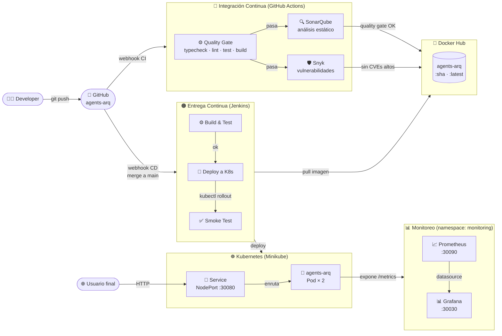
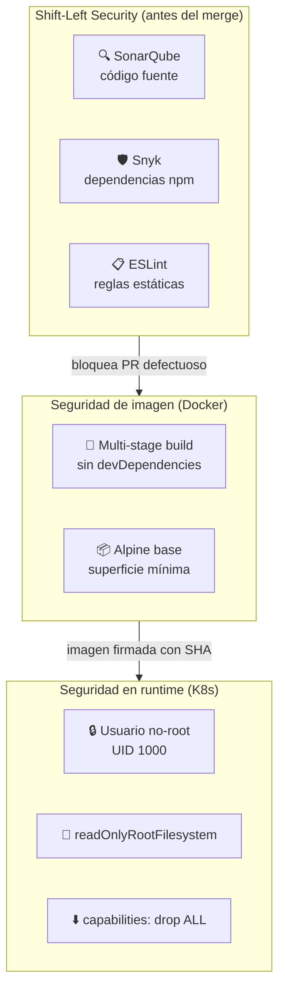

# Arquitectura General — agents-arq

Vista de alto nivel de todos los componentes del sistema y cómo se interconectan.

---

## Sistema completo (developer → producción)

---

## Modelo de seguridad en capas

