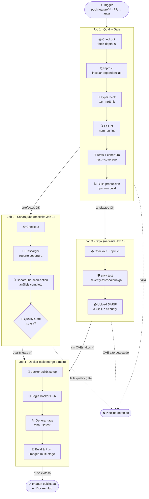
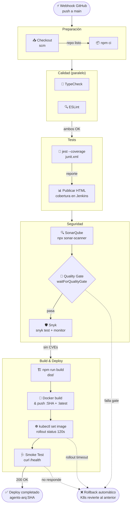

# Flujo CI/CD — agents-arq

Detalle de los dos pipelines: Integración Continua (GitHub Actions) y Entrega Continua (Jenkins).

---

## Pipeline CI — GitHub Actions

Se activa en cada `push` a `feature/**` y en cada Pull Request hacia `main`.  
Los 4 jobs se ejecutan en secuencia; un fallo detiene los siguientes.

---

## Pipeline CD — Jenkins

Se activa mediante webhook de GitHub al detectar un push a `main` (post-merge).  
Corre en un agente Docker `node:20-alpine` limpio por cada ejecución.

