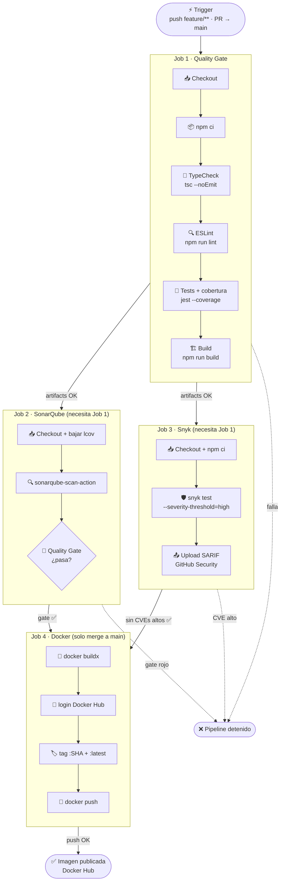
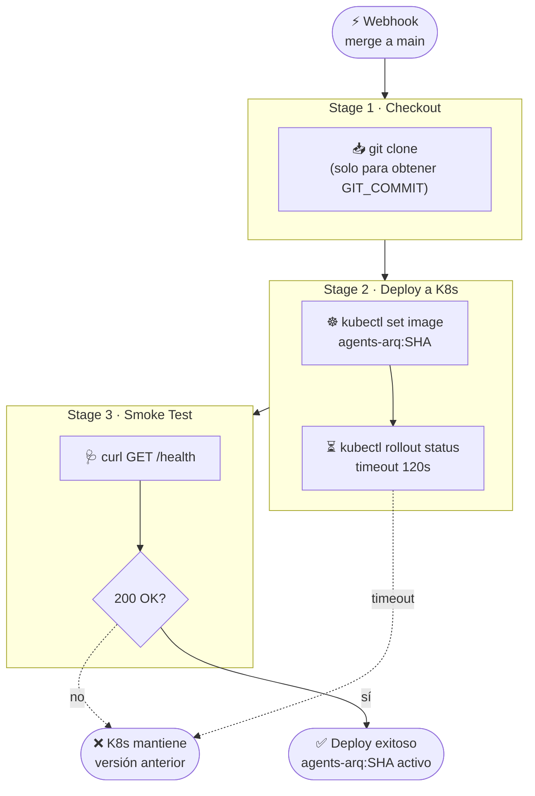

# Flujo CI/CD — agents-arq

Los dos pipelines tienen responsabilidades completamente separadas:
el **CI** valida la calidad y publica la imagen; el **CD** solo la despliega.

---

## Pipeline CI — GitHub Actions

Se activa en cada `push` a `feature/**` y en PRs hacia `main`.
Los 4 jobs corren en secuencia; cualquier fallo detiene los siguientes.

---

## Pipeline CD — Jenkins

Se activa por webhook al detectar merge a `main`.
**No repite pasos de CI** — simplemente toma la imagen ya publicada y la lleva al cluster.

