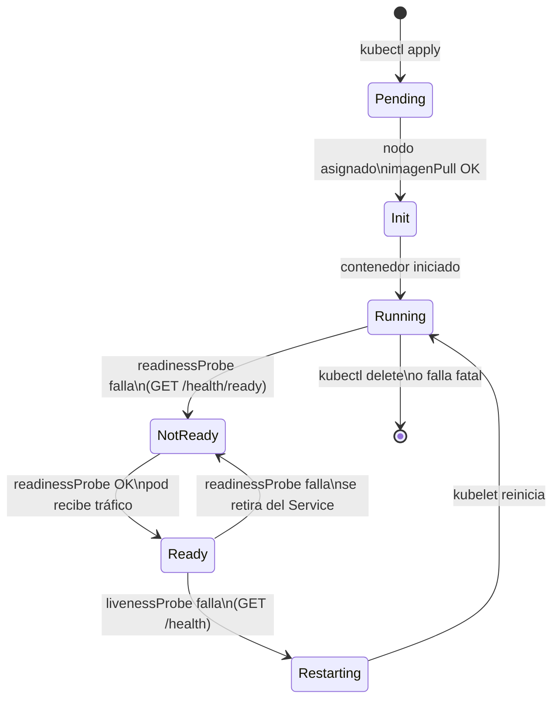
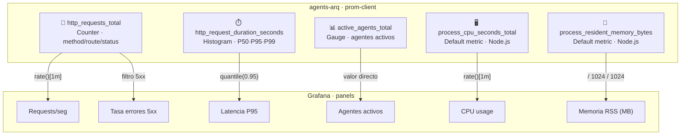

# Kubernetes y Monitoreo — agents-arq

El stack de Kubernetes corre en Minikube y está dividido en dos namespaces: **default** para la aplicación y **monitoring** para el stack de observabilidad (Prometheus + Grafana). Esta separación sigue el principio de responsabilidad única a nivel de infraestructura: los pods de la app no saben nada de monitoreo; simplemente exponen `/metrics` y Prometheus los descubre automáticamente a través de las anotaciones del Deployment.

---

## Objetos Kubernetes (namespace: default)

El Deployment mantiene **2 réplicas** del pod `agents-arq`. El Service de tipo NodePort expone el puerto 30080 hacia el exterior y distribuye el tráfico entre ambos pods mediante round-robin. Un ConfigMap inyecta las variables de entorno (`NODE_ENV`, `PORT`, `VERSION`) para que la imagen Docker sea agnóstica al entorno.

---

## Ciclo de vida del pod y probes

Kubernetes usa dos tipos de probes para decidir si un pod debe recibir tráfico o reiniciarse:

- **Readiness probe** (`GET /health/ready`, cada 10 s): determina si el pod está listo para recibir solicitudes. Si falla, el pod se retira silenciosamente del Service sin reiniciarse — útil durante arranque o sobrecarga temporal.
- **Liveness probe** (`GET /health`, cada 20 s): determina si el proceso sigue vivo. Si falla 3 veces seguidas, kubelet reinicia el contenedor.

Esta distinción evita que tráfico llegue a un pod que aún no terminó de inicializarse, y también evita reiniciar pods que simplemente están ocupados pero funcionales.

---

## Stack de monitoreo (namespace: monitoring)

Prometheus descubre los pods de la aplicación automáticamente gracias a las anotaciones `prometheus.io/scrape: "true"` en el Deployment. Cada 10 segundos hace scrape del endpoint `/metrics` de cada pod y almacena las series temporales. Grafana consume Prometheus como datasource y carga el dashboard `agents-arq-main` que fue provisionado automáticamente desde un ConfigMap — sin necesidad de configuración manual al arrancar.

Las reglas de alerta están definidas en `prometheus-config.yaml` y evalúan condiciones sobre las métricas en tiempo real:

| Alerta | Condición | Umbral |
|--------|-----------|--------|
| `HighErrorRate` | Tasa de errores 5xx | > 10% por 2 min |
| `HighResponseTime` | Latencia P95 | > 1 s por 5 min |
| `PodDown` | Pod sin responder | `up == 0` por 1 min |

---

## Métricas expuestas y su mapeo a paneles de Grafana

La aplicación instrumenta tres métricas propias con `prom-client` y además recolecta automáticamente las métricas de proceso de Node.js. Cada métrica alimenta directamente uno o más paneles del dashboard:

- `http_requests_total` es un **Counter** que se incrementa en cada request. Con `rate()[1m]` se obtiene el throughput actual y filtrando por `status_code=~"5.."` se calcula la tasa de errores.
- `http_request_duration_seconds` es un **Histogram** que registra la distribución de latencias. `histogram_quantile(0.95, ...)` da el P95 que aparece en el panel de latencia.
- `active_agents_total` es un **Gauge** que sube/baja según cuántos agentes hay en memoria. Se representa directamente como valor instantáneo.

