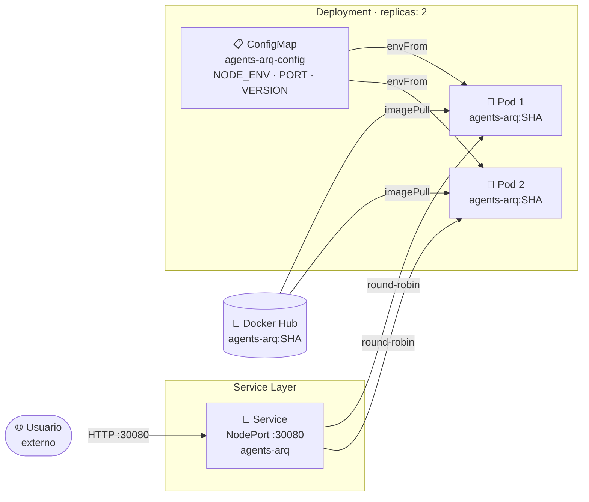
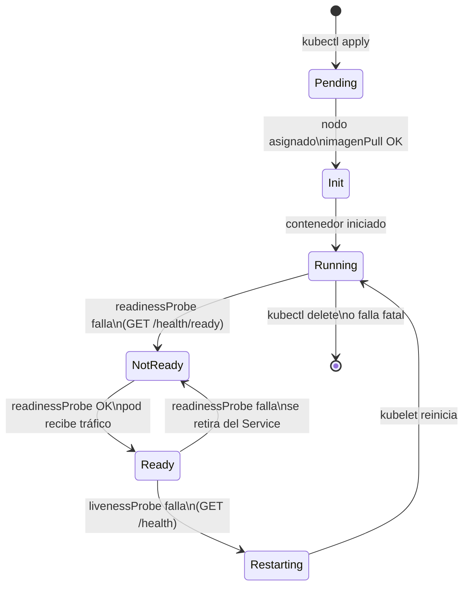
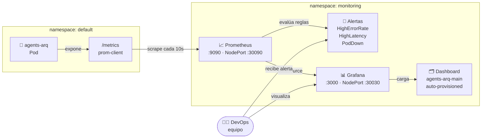
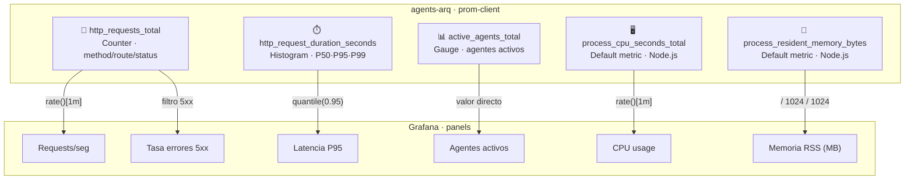

# Kubernetes y Monitoreo — agents-arq

Objetos K8s desplegados, ciclo de vida de un pod y stack de observabilidad.

---

## Objetos Kubernetes (namespace: default)

---

## Ciclo de vida del pod y probes

---

## Stack de monitoreo (namespace: monitoring)

---

## Métricas expuestas por la aplicación

