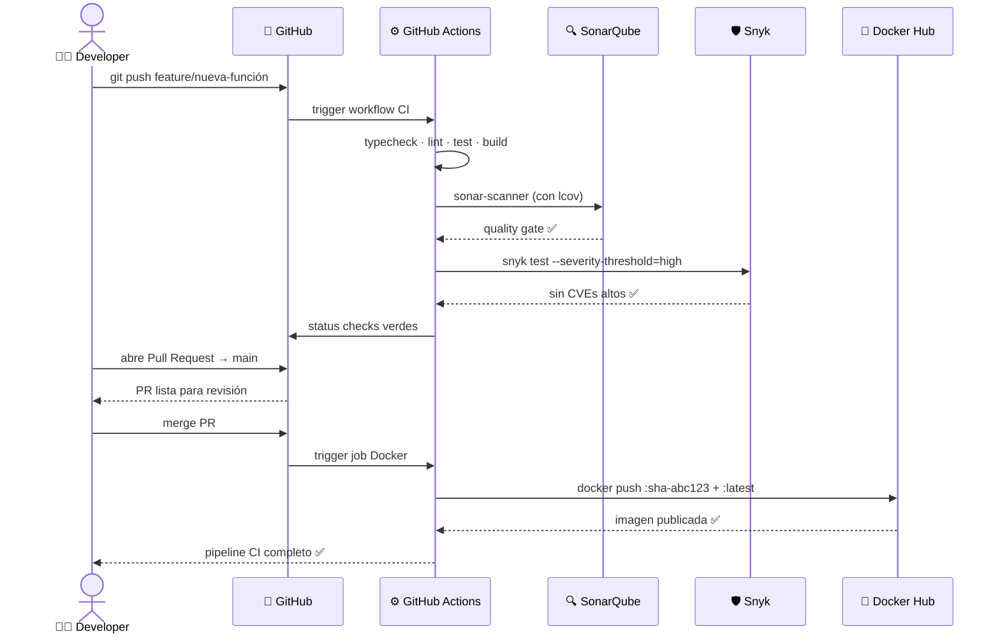
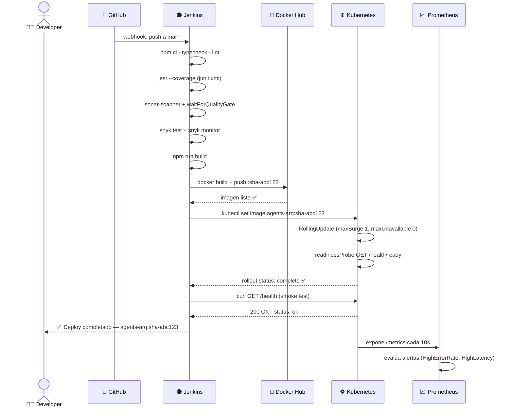
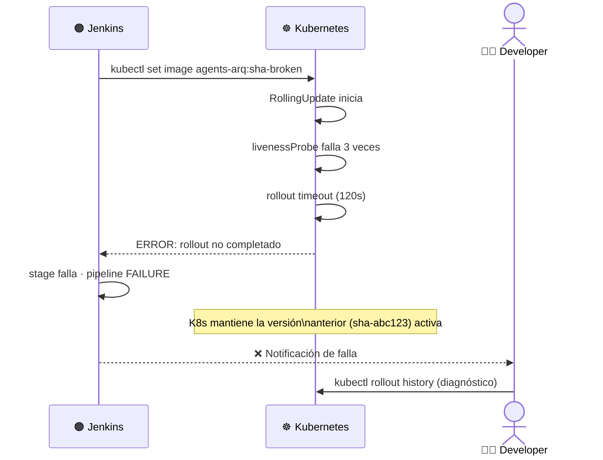

# Secuencia de Despliegue — agents-arq

Interacción entre actores en el ciclo completo: desde el commit hasta el tráfico en producción.

---

## Flujo CI completo (PR → merge)

---

## Flujo CD completo (merge → producción)

---

## Flujo de rollback automático

