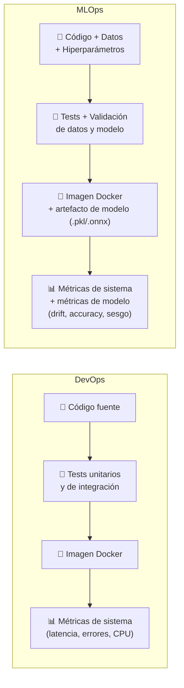

# Actividad 2 – Post-mortem y comparación DevOps vs MLOps

> **Curso:** Fundamentos de DevOps – Unisabana
> **Tipo:** Grupal · Entrega escrita

**Integrantes:**
- Santiago López Amaya — santiagoloam@unisabana.edu.co
- Jeisson Alejandro Fuquene Buitrago — jeissonfubu@unisabana.edu.co

---

## 1. Post-mortem del laboratorio

### ¿Qué salió bien?

La separación entre CI y CD fue una de las decisiones más acertadas del laboratorio. Definir que GitHub Actions es el responsable de la calidad —typecheck, lint, tests, SonarQube, Snyk— y que Jenkins es el responsable exclusivo del despliegue, simplificó radicalmente el Jenkinsfile: pasó de ser un pipeline que intentaba hacer todo a ser cuatro stages concretos (Checkout → Autenticar en GKE → Deploy → Smoke Test). Esta claridad redujo los errores de configuración y hace que cualquier persona del equipo pueda entender el pipeline de un vistazo.

El uso de Docker multi-stage build resultó muy efectivo para reducir el tamaño de la imagen final. Al separar el stage de compilación TypeScript del stage de runtime, la imagen de producción no contiene ni el código fuente TypeScript, ni las dependencias de desarrollo, ni el compilador. Esto reduce la superficie de ataque y el tiempo de descarga de la imagen en cada despliegue.

La instrumentación con `prom-client` desde el inicio del proyecto —en lugar de agregarla como una capa posterior— permitió que el stack de monitoreo estuviera listo en paralelo con la app. El dashboard de Grafana se provisionó automáticamente desde ConfigMaps, eliminando la configuración manual que suele ser fuente de inconsistencias entre entornos.

El contrato entre CI y CD quedó reducido a un solo dato: el tag inmutable de la imagen. GitHub Actions etiqueta cada build con `sha-<commit>` mediante `docker/metadata-action`, y Jenkins recibe ese tag como parámetro `IMAGE_TAG` sin reconstruir nada ni tener que deducir qué versión corresponde desplegar. El resultado es una trazabilidad completa —commit → imagen → pod— verificable en cualquier momento consultando el tag que corre en el clúster, y es la precondición técnica que hace posible un rollback confiable: basta con relanzar el pipeline con el tag anterior.

El uso de un agente efímero en Jenkins (`agent { docker { image 'google/cloud-sdk' } }`) evitó una fuente clásica de fragilidad: que el pipeline dependa de las herramientas instaladas en el servidor. Cada build arranca en un contenedor que ya trae `gcloud`, `kubectl` y el plugin de autenticación de GKE, y desaparece al terminar. Del lado del CI, dos ajustes pequeños tuvieron un impacto desproporcionado en el tiempo de feedback: la caché de capas de Docker sobre el runner (`cache-from/to: type=gha`) y `concurrency: cancel-in-progress`, que cancela los runs obsoletos cuando llegan commits nuevos sobre la misma rama en lugar de dejarlos competir por los ejecutores.

### ¿Qué salió mal o fue más difícil de lo esperado?

La configuración del Quality Gate de SonarQube requirió más iteraciones de las esperadas. El token de autenticación, la URL del servidor y la acción `waitForQualityGate` tienen dependencias de timing que no son evidentes en la documentación oficial: el análisis puede terminar sin que el Quality Gate haya sido evaluado, lo que genera falsos positivos en el pipeline. La solución fue agregar un polling explícito y ajustar el timeout del workflow.

Los probes de Kubernetes (liveness y readiness) en el Deployment inicial apuntaban al mismo endpoint `/health`, lo que genera un problema de diseño: si la app está viva pero cargada, el liveness probe la reinicia innecesariamente. Fue necesario separar los endpoints (`/health` para liveness, `/health/ready` para readiness) y ajustar los parámetros de `initialDelaySeconds` y `failureThreshold` para evitar reinicios prematuros durante el arranque del pod.

La autenticación de Jenkins contra GKE fue más laboriosa de lo previsto. No basta con guardar una credencial: hay que activar una Service Account de GCP desde su archivo de clave JSON (`gcloud auth activate-service-account`), pedir las credenciales del clúster (`gcloud container clusters get-credentials`) y habilitar explícitamente `USE_GKE_GCLOUD_AUTH_PLUGIN=True`, porque a partir de la versión 1.26 de `kubectl` el proveedor de autenticación de GCP dejó de estar integrado y pasó a vivir en un plugin externo. El error que produce su ausencia no señala la causa real, así que el diagnóstico llevó más tiempo del que debería. A eso se sumó `CLOUDSDK_CORE_DISABLE_PROMPTS=1`, necesario para que `gcloud` no quede esperando una respuesta interactiva que dentro de un pipeline nadie va a dar.

Desplegar en un clúster gestionado impuso una lista de ajustes que el manifiesto no anticipaba. GKE Autopilot administra los nodos, y esa comodidad viene acompañada de restricciones estrictas: los nodos no tienen IP externa, de modo que la exposición quedó en `ClusterIP` + `port-forward`; Prometheus no descubría ningún pod hasta que se le dio RBAC propio (ServiceAccount + ClusterRole + ClusterRoleBinding), un fallo silencioso que no se manifiesta como error de arranque sino como una lista de targets vacía; hubo que eliminar el job de scrapeo `kubernetes-nodes` porque el kubelet no es accesible sin autenticación en Autopilot; y los `resources` tuvieron que declararse con `requests` iguales a `limits`, con la CPU en múltiplos de 250m y una relación memoria:CPU dentro del rango admitido, ya que de lo contrario la plataforma redondea los valores hacia arriba y factura de más. También fue necesario ajustar el `securityContext` al UID real de cada imagen (1000 para la app, 65534 para Prometheus, 472 para Grafana) y declarar `seccompProfile: RuntimeDefault`. Por último, el arranque en frío es notablemente más lento —Autopilot escala nodos bajo demanda—, lo que obligó a subir el timeout del `rollout status` a 180 segundos para que el pipeline no fallara por impaciencia en lugar de por un problema real.

La inyección del tag en el manifiesto se resolvió con una sustitución de texto: `app.yaml` lleva el placeholder `__IMAGE__` y el pipeline ejecuta `sed` antes de pasar el resultado a `kubectl apply`. Funciona, pero es frágil por definición: opera sobre texto plano, no valida el esquema del YAML y no detecta si el placeholder desapareció en una edición posterior. Es exactamente el problema para el que existen herramientas de plantillas como Kustomize o Helm.

El hallazgo más incómodo del laboratorio es que las alertas no alertan a nadie. Las tres reglas definidas en Prometheus (`HighErrorRate`, `HighLatency`, `PodDown`) se evalúan correctamente, pero sin Alertmanager desplegado su único efecto es generar la métrica `ALERTS`, consultable en la UI de Prometheus. El sistema sabe cuándo algo va mal, pero no tiene forma de decírselo a nadie. Detectarlo obligó a distinguir entre **definir** una alerta y **entregar** una notificación, dos cosas que la documentación de Prometheus suele presentar tan juntas que es fácil asumir que la segunda viene incluida con la primera.

### ¿Qué aprendimos?

El laboratorio hizo evidente que DevOps no es una herramienta sino una cadena de decisiones de diseño. Cada herramienta cumple un rol específico en el pipeline, y la efectividad del sistema depende de que esos roles estén bien definidos y no se solapen. Cuando Jenkins intentaba hacer lo mismo que GitHub Actions (ejecutar tests, SonarQube, Snyk), el resultado era un pipeline lento, frágil y difícil de depurar. Cuando cada herramienta hizo solo lo que le corresponde, el sistema se volvió coherente.

También aprendimos que el monitoreo es parte del contrato de la aplicación, no un complemento opcional. Instrumentar la app desde el código (métricas propias + métricas de runtime de Node.js) y conectarlas a alertas con umbrales concretos transforma el monitoreo de una actividad reactiva a una proactiva. Ahora bien, el laboratorio también mostró dónde termina esa transformación: instrumentar la app y fijar umbrales concretos —tasa de errores por encima del 10%, P95 por encima de 1 segundo— es la primera mitad del trabajo; la segunda, el componente que convierte una regla evaluada en una notificación que llega a una persona, es una pieza aparte que hay que desplegar de forma explícita.

Aprendimos también que un manifiesto válido de Kubernetes no es automáticamente desplegable en cualquier clúster. La API es la misma, pero cada distribución impone su propio conjunto de restricciones —RBAC, formas de exposición de red, requisitos de `resources` y `securityContext`— y esas restricciones no se manifiestan como errores de sintaxis sino como comportamientos silenciosos: un target que nunca aparece, un pod que arranca pero no se puede alcanzar, un recurso que se acepta pero se factura distinto. La portabilidad en Kubernetes es de la API, no de la configuración.

Por último, el smoke test enseñó a leer con cuidado qué valida realmente una verificación. El del pipeline ejecuta `wget` contra `/health` desde dentro del propio pod: confirma que el proceso arrancó y responde, pero no atraviesa el Service ni la red del clúster. Un selector mal escrito, un puerto mal mapeado o un fallo de DNS pasarían el smoke test en verde. Una verificación que no recorre el mismo camino que el usuario no es una prueba de extremo a extremo, y conviene ser explícito sobre esa diferencia en lugar de asumir que el verde del pipeline cubre todo el trayecto.

### ¿Qué podemos mejorar?

El pipeline actual no incluye tests de carga ni tests de integración contra dependencias reales (bases de datos, servicios externos). Incorporar una herramienta como **k6** o **Artillery** en una etapa post-deploy permitiría detectar regresiones de rendimiento antes de que los usuarios las experimenten. Esto completaría el ciclo de calidad que actualmente solo cubre la corrección funcional (tests unitarios) y la seguridad estática (SonarQube, Snyk).

El Deployment corre con una sola réplica. La configuración `maxSurge: 1` / `maxUnavailable: 0` evita el corte durante el rollout —Kubernetes levanta el pod nuevo y espera su readiness antes de terminar el anterior—, pero deja al servicio sin ninguna redundancia fuera de ese momento: un fallo del pod, un desalojo por reprogramación de Autopilot o el reinicio del nodo dejan la aplicación en cero instancias. Subir a dos réplicas es el paso mínimo; el siguiente es una estrategia Blue/Green o Canary que, además de eliminar ese riesgo, permita validar la versión nueva con un subconjunto del tráfico antes de migrar el 100%.

La mejora de mayor impacto sería migrar la etapa de CD a un enfoque **GitOps con Argo CD**. Hoy el despliegue es *push-based*: Jenkins se autentica con una Service Account de GCP, obtiene las credenciales del clúster y ejecuta `kubectl apply` desde fuera. Esto implica que el estado real del clúster solo lo conoce quien lo mira directamente, que Jenkins necesita una identidad con permisos de escritura sobre el clúster, y que cualquier cambio manual (`kubectl edit`, un escalado de emergencia) queda fuera del control de versiones y se pierde silenciosamente en el siguiente despliegue. Con GitOps el modelo se invierte a *pull-based*: los manifiestos de Kubernetes viven en un repositorio Git que es la **única fuente de verdad**, y un agente instalado dentro del clúster —Argo CD— compara continuamente el estado deseado declarado en Git contra el estado real y reconcilia la diferencia (Argo Project, 2024; OpenGitOps, 2023).

En términos concretos para este laboratorio, el cambio significaría separar el repositorio de aplicación del repositorio de manifiestos: GitHub Actions seguiría siendo responsable de la calidad y, al final del pipeline, publicaría la imagen en el registry y actualizaría el tag de esa imagen en el repo de manifiestos mediante un commit o un Pull Request. Jenkins dejaría de necesitar credenciales del clúster por completo —la clave de la Service Account de GCP, hoy la credencial más sensible del pipeline—, porque es Argo CD quien detecta el commit y aplica el cambio desde dentro del clúster. Además, la actualización del tag pasaría a resolverse con `kustomize edit set image` en lugar del `sed` sobre el placeholder `__IMAGE__`, eliminando la manipulación de YAML por texto plano. El beneficio operativo es triple: **auditoría** —cada despliegue es un commit con autor, fecha y revisor—; **rollback trivial** —revertir el commit devuelve el clúster a la versión anterior sin reejecutar un pipeline—; y **detección de drift** —Argo CD marca la aplicación como *OutOfSync* cuando alguien modifica el clúster por fuera de Git, y puede corregirlo automáticamente con `selfHeal`—.

Este enfoque además complementa la mejora anterior sobre estrategias de despliegue: **Argo Rollouts** reemplaza el objeto `Deployment` por un `Rollout` que soporta Blue/Green y Canary de forma declarativa, con pasos de promoción progresiva (por ejemplo, 10% → 30% → 100% del tráfico) y *analysis templates* que consultan las métricas ya expuestas en Prometheus. Con esa pieza, las alertas de tasa de error y latencia P95 que hoy solo notifican al equipo pasarían a **abortar y revertir automáticamente** un despliegue defectuoso antes de que alcance a todos los usuarios, cerrando el ciclo entre el monitoreo y el despliegue.

Antes de eso, sin embargo, hay una pieza más básica pendiente: desplegar **Alertmanager** junto a Prometheus y conectarlo a un canal real —Slack, correo o PagerDuty—, con reglas de agrupación y silenciado para evitar la fatiga de alertas. Es poca configuración, pero es lo que convierte las tres reglas ya definidas en algo que efectivamente interrumpe a una persona cuando el servicio se degrada, en lugar de una métrica que alguien tiene que acordarse de consultar.

En seguridad, el pipeline analiza el código (SonarQube) y las dependencias de npm (Snyk), pero no la imagen que finalmente se despliega. Agregar un escaneo del artefacto construido —`snyk container` o **Trivy**— cubriría las vulnerabilidades del sistema operativo base, que no aparecen en el `package-lock.json` y por lo tanto hoy pasan sin ser vistas. Completarían esa capa la generación de un **SBOM** y la firma de la imagen con **cosign**, de modo que el clúster pueda verificar que despliega exactamente el artefacto que produjo el CI. En la misma línea, Grafana arranca con las credenciales por defecto y depende de que alguien las cambie en el primer login; definirlas desde un `Secret` gestionado fuera del repositorio haría el arranque reproducible y no dependiente de una acción manual.

---

## 2. DevOps vs MLOps — diferencias, similitudes y por qué importa la distinción

### Qué comparten

DevOps y MLOps parten del mismo principio fundacional: acortar el ciclo entre el desarrollo de un artefacto y su operación en producción, mediante automatización, observabilidad y ciclos de retroalimentación rápidos (Kreuzberger et al., 2023). Ambas disciplinas aplican pipelines de CI/CD, control de versiones, contenedores, monitoreo continuo y colaboración entre equipos de desarrollo y operaciones.

El stack construido en este laboratorio —GitHub Actions, Jenkins, Docker, Kubernetes, Prometheus y Grafana— es perfectamente válido como base de un sistema MLOps. Las diferencias no están en las herramientas sino en **qué se versiona, qué se valida y qué se monitorea**.

### Qué los diferencia

La diferencia estructural más profunda es que en MLOps **los datos son un artefacto de primera clase** junto al código (Sculley et al., 2015). Un modelo de machine learning puede degradarse en producción sin que una sola línea de código cambie: basta con que la distribución de los datos de entrada se aleje de la distribución con la que fue entrenado, fenómeno conocido como **data drift** o **concept drift**.

Esto introduce una capa de complejidad que DevOps no tiene:

| Dimensión | DevOps | MLOps |
|-----------|--------|-------|
| Artefacto principal | Código compilado / imagen Docker | Código + dataset + artefacto de modelo |
| Versionado | Git (código) | Git (código) + DVC / MLflow (datos y modelos) |
| Validación en CI | Tests unitarios, typecheck, lint | Tests unitarios + validación de esquema de datos + evaluación de métricas del modelo |
| Trigger de reentrenamiento | Push de código | Push de código **o** degradación de métricas en producción |
| Monitoreo | Latencia, tasa de error, CPU, memoria | Todo lo anterior + accuracy, data drift, model drift, fairness |
| Rollback | Desplegar imagen anterior | Desplegar modelo anterior y, potencialmente, restaurar pipeline de datos |

### El ciclo MLOps y su relación con este laboratorio

En MLOps, el ciclo de vida no termina en el despliegue: el modelo en producción genera datos de inferencia que retroalimentan el pipeline de reentrenamiento. Si Prometheus detecta que la distribución de las predicciones se desvía, puede disparar un re-entrenamiento automático en lugar de una alerta de sistema (Shankar et al., 2022).

El laboratorio implementa exactamente la primera mitad de ese ciclo: el pipeline de CI/CD que valida, empaqueta y despliega el artefacto. En un sistema MLOps completo, este pipeline se extendería con:

1. **Registro de modelos** (MLflow Model Registry, Vertex AI) — versionado del artefacto `.pkl`/`.onnx` con sus métricas de evaluación.
2. **Validación de datos** (Great Expectations, TFDV) — esquemas que bloquean el pipeline si los datos de entrenamiento tienen valores nulos inesperados, distribuciones fuera de rango o cambios de tipo.
3. **Monitoreo de modelo** (Evidently, Whylogs, Seldon Alibi) — dashboards en Grafana que muestran, junto a la latencia, la distribución de las predicciones y el accuracy en datos recientes.

### Por qué la distinción importa en la práctica

Un equipo que intenta aplicar DevOps a un proyecto de ML sin adaptar las prácticas suele encontrarse con que el pipeline pasa todos los tests y despliega exitosamente, pero el modelo en producción toma decisiones cada vez peores sin que ninguna alerta se dispare. La causa es que las métricas de sistema (Prometheus, Grafana) reportan que todo está bien: la latencia es baja y no hay errores 5xx. El problema no es técnico sino estadístico.

MLOps no reemplaza a DevOps; lo extiende para cubrir la dimensión que los modelos añaden: la dependencia de los datos. La infraestructura de CI/CD, contenedores, Kubernetes y monitoreo construida en este laboratorio es la base correcta sobre la que se construye MLOps; la diferencia está en los artefactos que fluyen por esa infraestructura y en las métricas que se observan.

---

## 3. Referencias

Kreuzberger, D., Kühl, N., & Hirschl, S. (2023). *Machine learning operations (MLOps): Overview, definition, and architecture*. IEEE Access, 11, 31866–31879. https://doi.org/10.1109/ACCESS.2023.3262138

Argo Project. (2024). *Argo CD – Declarative GitOps CD for Kubernetes* [Documentación oficial]. https://argo-cd.readthedocs.io/en/stable/

Sculley, D., Holt, G., Golovin, D., Davydov, E., Phillips, T., Ebner, D., Chaudhary, V., Young, M., Crespo, J. F., & Dennison, D. (2015). *Hidden technical debt in machine learning systems*. Advances in Neural Information Processing Systems, 28, 2503–2511. https://proceedings.neurips.cc/paper_files/paper/2015/file/86df7dcfd896fcaf2674f757a2463eba-Paper.pdf

Shankar, S., Garcia, R., Hellerstein, J. M., & Parameswaran, A. G. (2022). *Operationalizing machine learning: An interview study*. arXiv preprint arXiv:2209.09125. https://arxiv.org/abs/2209.09125

OpenGitOps. (2023). *GitOps principles v1.0.0*. Cloud Native Computing Foundation. https://opengitops.dev/

Kim, G., Humble, J., Debois, P., Willis, J., & Forsgren, N. (2021). *The DevOps Handbook: How to Create World-Class Agility, Reliability, & Security in Technology Organizations* (2nd ed.). IT Revolution Press.
